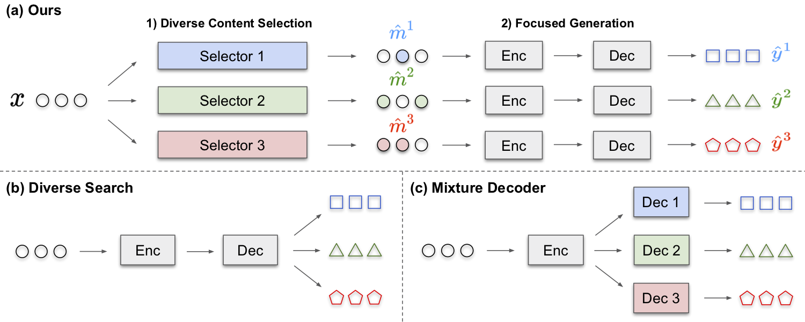

## Mixture Content Selection for Diverse Sequence Generation

* Authors: [Jaemin Cho](http://j-min.io), [Minjoon Seo](https://seominjoon.github.io), [Hannaneh Hajishirzi](https://homes.cs.washington.edu/~hannaneh/)
* [Paper](https://arxiv.org/abs/1909.01953) (To appear in [EMNLP 2019](https://emnlp-ijcnlp2019.org))

We *explicitly separate diversification from generation* using a mixture-of-experts content selection module (called **Selector**) that guides an encoder-decoder model.



1.  During diversification stage, Selector samples different binary masks (called **focus**; m1, m2, and m3 in the figure) on a source sequence.

2.  During generation stage, an encoder-decoder model generates different sequences from the source sequence guided by different masks.

Not only does this improve **diversity** of the generated sequences, but also improves **accuracy** (high fidelity) of them, since conventional models often learn suboptimal mapping that is in the middle of the targets but not near any of them.

# Prerequisites

## 1) Hardware
* All experiments in paper were conducted with single P40 GPU (24GB) and 20+ CPUs.
* You might want to adjust the size of batch, models and number of workers for your memory size and number of CPUs.

## 2) Software
* Ubuntu 16.04 or 18.04 (Not tested with other versions, but might work)
* Python 3.6+
  - `pip install -r requirements.txt` or manually install the packages below.
  ```
  torch >= 1.0
  nltk
  pandas
  tqdm
  pyyaml
  pyrouge
  ```
* ROUGE-1.5.5 (for CNN-DM evaluation)
  ```sh
  # From https://github.com/falcondai/pyrouge/tree/9cdbfbda8b8d96e7c2646ffd048743ddcf417ed9
  wget https://www.dropbox.com/s/dl/zqhvtgfg40h3g3l/rouge_1.5.5.zip
  unzip rouge_1.5.5.zip
  mv RELEASE-1.5.5 utils/rouge
  ```

## 3) Data

```sh
# Download preprocessed data at ./squad/, ./cnndm/ and ./glove/ respectively
wget https://www.dropbox.com/s/dl/0gtz5ckh3ie55oq/emnlp2019focus_redistribute.zip
unzip emnlp2019focus_redistribute.zip

# Generate train_df.pkl, val_df.pkl, test_df.pkl and vocab.pkl at ./squad_out/
python QG_data_loader.py

# Generate train_df.pkl, val_df.pkl, test_df.pkl and vocab.pkl at ./cnndm_out/
python CNNDM_data_loader.py
```
Details of dataset source are at [Dataset_details.md](Dataset_details.md)

# Run (Train & Evaluation)
You can see more configurations in [configs.py](configs.py)

1) Question Generation
```sh
python train.py --task=QG --model=NQG --load_glove=True --feature_rich --data=squad \
    --rnn=GRU --dec_hidden_size=512 --dropout=0.5 \
    --batch_size=64 --eval_batch_size=64 \
    --use_focus=True --n_mixture=3 --decoding=greedy
```

2) Abstract Summrization
```sh
python train.py --task=SM --model=PG --load_glove=False --data=cnndm \
    --rnn=LSTM --dec_hidden_size=512 \
    --batch_size=16 --eval_batch_size=64 \
    --use_focus=True --n_mixture=3 --decoding=greedy
```

# Reference
If you use this code or model as part of any published research, please refer the following paper.
```BibTex
@inproceedings{cho2019focus,
  title     = {Mixture Content Selection for Diverse Sequence Generation},
  author    = {Cho, Jaemin and Seo, Minjoon and Hajishirzi, Hannaneh},
  booktitle = {EMNLP},
  year      = {2019}
}
```

# License

```
Copyright (c) 2019-present NAVER Corp.

Permission is hereby granted, free of charge, to any person obtaining a copy
of this software and associated documentation files (the "Software"), to deal
in the Software without restriction, including without limitation the rights
to use, copy, modify, merge, publish, distribute, sublicense, and/or sell
copies of the Software, and to permit persons to whom the Software is
furnished to do so, subject to the following conditions:

The above copyright notice and this permission notice shall be included in
all copies or substantial portions of the Software.

THE SOFTWARE IS PROVIDED "AS IS", WITHOUT WARRANTY OF ANY KIND, EXPRESS OR
IMPLIED, INCLUDING BUT NOT LIMITED TO THE WARRANTIES OF MERCHANTABILITY,
FITNESS FOR A PARTICULAR PURPOSE AND NONINFRINGEMENT.  IN NO EVENT SHALL THE
AUTHORS OR COPYRIGHT HOLDERS BE LIABLE FOR ANY CLAIM, DAMAGES OR OTHER
LIABILITY, WHETHER IN AN ACTION OF CONTRACT, TORT OR OTHERWISE, ARISING FROM,
OUT OF OR IN CONNECTION WITH THE SOFTWARE OR THE USE OR OTHER DEALINGS IN
THE SOFTWARE.
```
